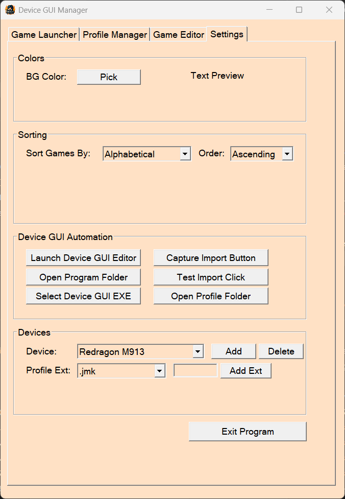
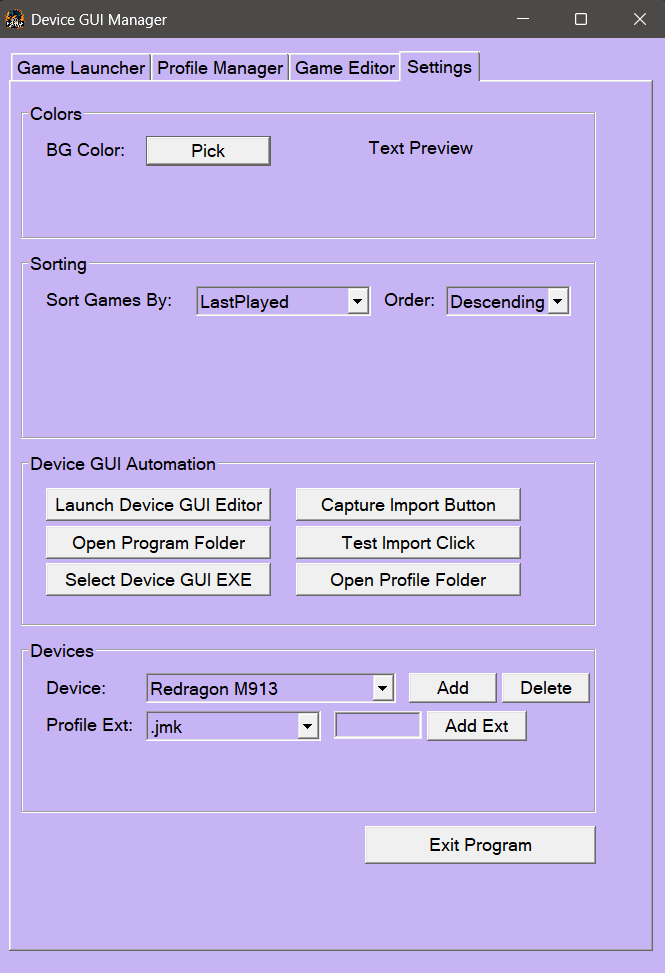
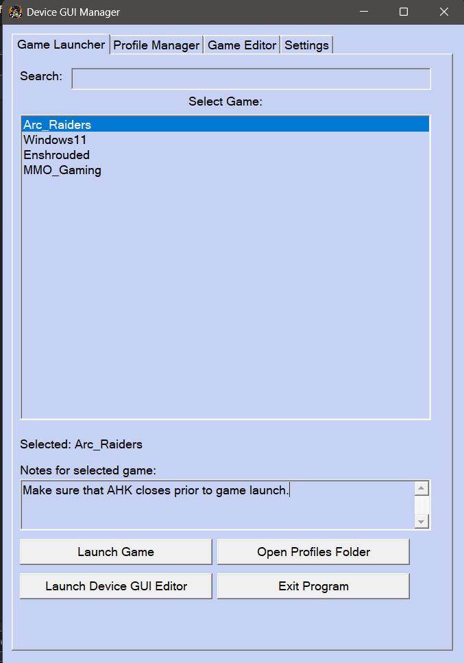

# 🐉 XB Profile Manager

**by eXBonez (R. Bruno)**


🐭⌨️ A simple yet powerful **AutoHotkey v2** tool to automate profile loading for budget mice and keyboards (e.g., M913 Impact) — and **any other software** with a GUI "Import/Load" button.

Perfect for MMO gamers who switch complex macros between games! 🎮⚔️

## 🚀 Key Features

- ⚡ **Auto profile import** when launching games — no more manual clicks!
- 🖱️ **Create desktop shortcuts** — double-click to launch any game with its custom profile loaded instantly.
- 📁 **Unlimited profiles** — organize with powerful search, notes, and one-click backups.
- 🔍 **Powerful search & filtering** — quickly find any game or profile by name.
- 📝 **Profile/game notes** — add personal reminders or setup tips for each entry.
- 🎯 **Per-game settings** — custom delays, launch tracking, and last-played timestamps.
- 📊 **Launch tracking** — see when games were last played (with smart sorting options).
- 🎛️ **Customizable sorting** — alphabetical, by added date, or last played.
- ⚙️ **Universal "Import" button capture** — works with **any** software (Redragon, Logitech, Razer, etc.) — just hover + F8!
- 🛡️ **One-click backups** — safely copy profiles to prevent loss.
- 🪶 **Lightweight & fully portable** — runs from anywhere, no admin rights or installation needed (beyond AutoHotkey v2).
- 🌐 **No dependencies** — completely standalone and easy to share.
- 🎨 **Custom Color Theme Picker** — change the app's look to anything you want — even paste HEX codes!
- 🖥️ **Multiple Device Support** — manage different hardware devices (mice, keyboards) in one interface!
- 🔄 **Multi-Click Import Support** — capture sequences of multiple clicks for complex import workflows!
- ⚡ **CLI Mode** — launch games directly from command line or batch scripts!
- 🚨 **Smart Error Handling** — clear warnings when device software isn't properly loaded!

Enjoy seamless profile switching! 🚀🐉

## 📥 Installation
You can skip step 1 if you use the exe file instead of the AHK
1. Install **AutoHotkey v2** (free) from [autohotkey.com](https://www.autohotkey.com/).
2. Download the latest release from GitHub.
3. Extract the files and run `XB_GUI_Profile_Manager.ahk or exe`.

## ⚙️ Setup (First Time Only)

1. **Add a Device** (Settings tab → Devices section)
   - Click "Add" → enter device name (e.g., "M913-Impact", "K552 Keyboard")
   
2. **Configure Device**:
   - Select device from dropdown
   - Click "Select Device GUI EXE" → choose your device software's `.exe` (e.g., `OemDrv.exe`)
   - Click "Capture Import Button" → hover mouse over the "Import/Load" button → press **F8**
   - Test with "Test Import Click"
   
3. **Set Profile Folder**:
   - Click "Set Device Profile Folder" → choose where your profile files are stored
   - Add file extensions your device uses (e.g., `jmk`, `prf`, `cfg`)
   
4. **Add Your First Game**:
   - Switch to Game Editor tab
   - Enter game name, browse for EXE, select profile file
   - Click "Add/Update" to save

## 🎮 Basic Use

- **Add a game**: Game Editor tab → enter name → browse game EXE & profile → save.
- **Launch games**: Game Launcher tab → select game → click "Launch Game".
- **Create shortcut**: In Game Editor → select a game → click "Create Shortcut" (saves to your desktop).
- **Manage profiles**: Use the Profile Manager tab for imports and backups.
- **Switch devices**: Use the device dropdown in any tab to switch between configured hardware.

## 💡 Advanced Features

### 🖱️ Multi-Click Import Sequences
Some device software requires multiple clicks to import profiles. Use "Capture Import Button" → enter number of clicks needed → record each click position with F8.

### ⚡ CLI/Shortcut Launching
Create desktop shortcuts that launch games with profiles pre-loaded:
```
XB_GUI_Profile_Manager.exe /launch "GameName" "DeviceName"
```

### 🎨 Theme Customization
- Settings tab → Colors section → "Pick" to choose background color
- Text color automatically adjusts for readability
- Settings are saved between sessions

### 📊 Launch Statistics
Track how often and when you play each game:
- Launch count increments automatically
- Last played timestamp updates on each launch
- Sort games by most played or recently played

## ⚠️ Troubleshooting

- **"GUI Not Loaded Properly"**: Ensure your device is connected and its software is running correctly.
- **Profile not importing**: Check that import button coordinates are correct (re-capture if needed).
- **Device not appearing**: Make sure the device software EXE path is set correctly in Settings.

## ⚠️ Disclaimer

This tool is **unofficial** and not affiliated with or endorsed any hardware/software manufacturer.  
It interacts with third-party software by automating mouse clicks and file operations.  
Use entirely at your own risk — the author is not responsible for any damage, data loss, or issues caused to your devices, software, or profiles.  
Always back up your original profiles before using this tool.

## 💡 Tips & Notes

> If your file explorer takes a long time to open (e.g., due to network drives or sleeping drives), just try importing again — it will properly load the profile.  
> Use the notes feature to document special keybindings or macro setups for each profile!  
> Regular backups prevent loss if you experiment with new profile configurations.

— **eXBonez** 🐉


https://github.com/user-attachments/assets/257511da-49b9-4543-baf7-82f4cf03c391






